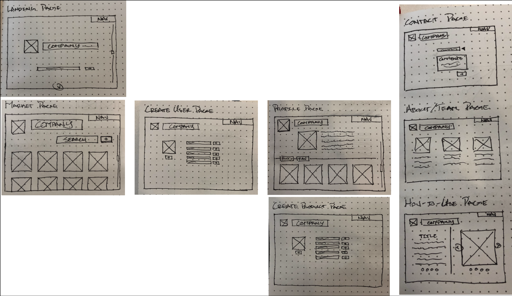

# Compass Rose

This app creates a space for custom flower breeders to create a profile and post their products.  As well, non-flower breeders are welcome to create a profile and/or just browse the flowers!

[Link to project hosted on Heroku](https://compassrose.herokuapp.com/)

---

## User Stories
---
__Goals__
_A user should be able to:_
1. Create a profile
2. Create a flower
3. Add flowers to the shopping cart
4. Remove flowers from the shopping cart

## Wireframes
---

## Technologies Used
---
* HTML & CSS
* Javascript & JQuery
* MongoDB, Heroku, & Github
* Express, Mongoose, & Body-Parser
* Google
* Adobe Illustrator
* Whiteboards
* Instructors & Peers

## Existing Features
---
* Add & Remove Profile from the Profile Page
* Add & Remove Product from the Market Page
* Add & Remove Order (Shopping Cart)
* Search Through the Market Page for Flowers Based on Search Query

## Planned Features
---
Add:
* A 'User Login & Password'
* Edit Buttons for the Users Profiles and Products
* Fully Functioning eCommerce Capabilities
* MapBody API to Show the Flower Locations / Vendors
* A 'Favorites' Button to Display Flowers on User Profile Pages
* Likes Feature on Products (in Addition to Favorites)
* Link Products to User Profile Page
* Contact User Modal
* Comment Section on Flowers
* An Events Page Using the MeetUp API
* Image Upload from Multer

---

##### Screenshot

